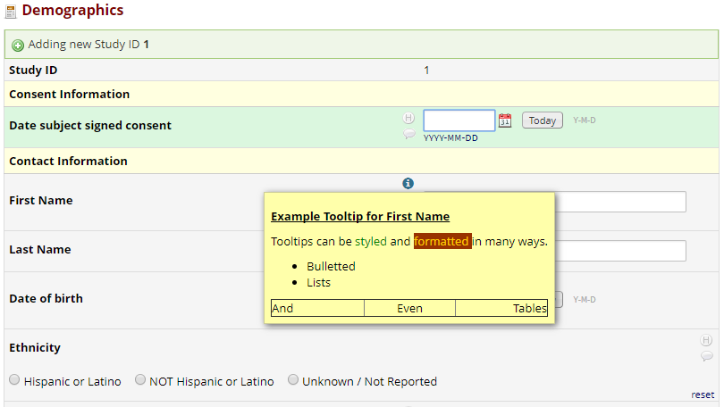
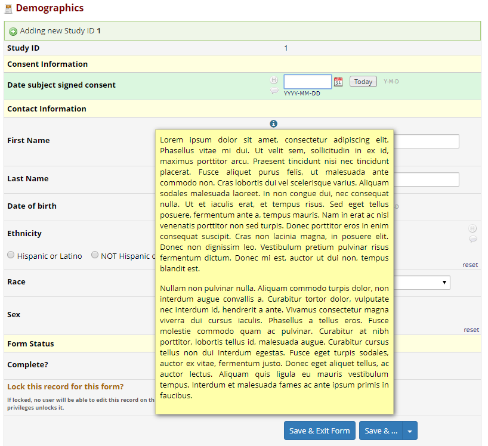

# redcap-em-form-field-tooltip
External Module for REDCap to inject tooltips to data entry forms

## Prerequisites
- REDCap >= 8.0.0

## Configuration
- Enable the module in your project if not already enabled
- Click **Configure** for **Form Field Tooltip Module**
- Select the field you wish to add a tooltip for
- Design the tooltip content in the rich text editor below
- To add additional tooltips, click on the '+' button

## Considerations
- Put as much detail in the tooltips as is necessary, but be wary of the length
  - Too much content and it may fall below the screen

## Future Support
- Possible features that might come in future updates (depending on your feedback)
  - An option to specify the where the tooltip opens, relative to the cursor (i.e. top center, bottom right, etc.)
  - Limit tooltips to 1 per field (currently there is no limit)
