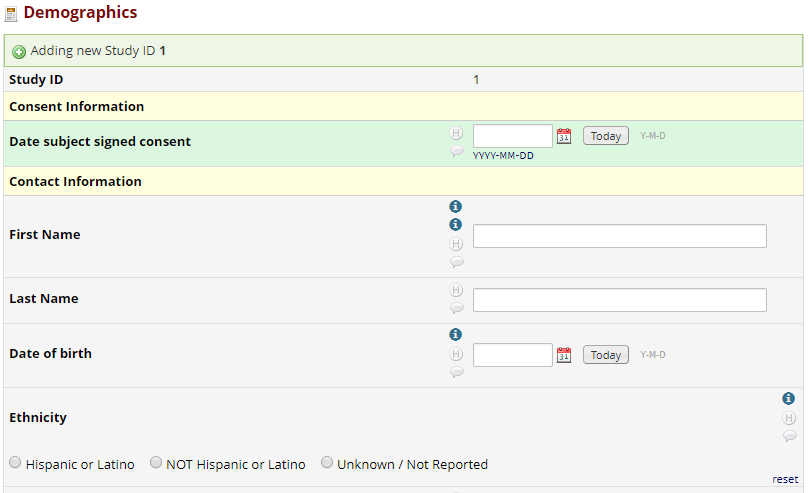
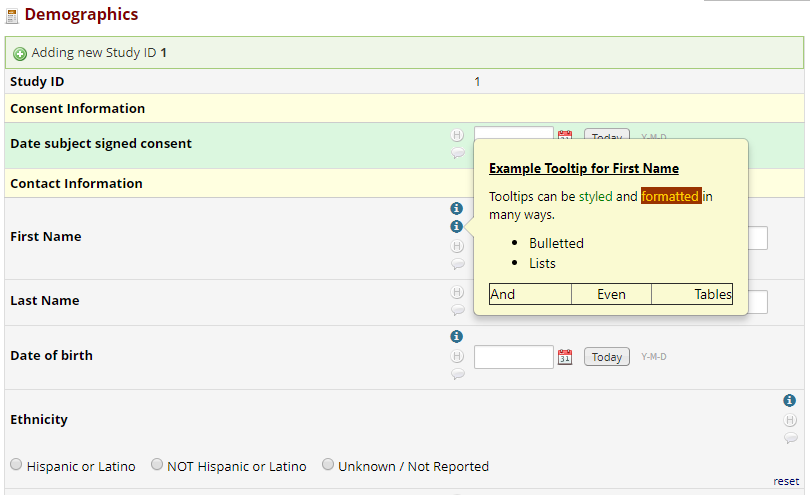
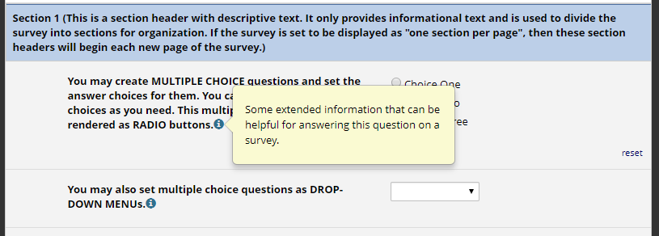
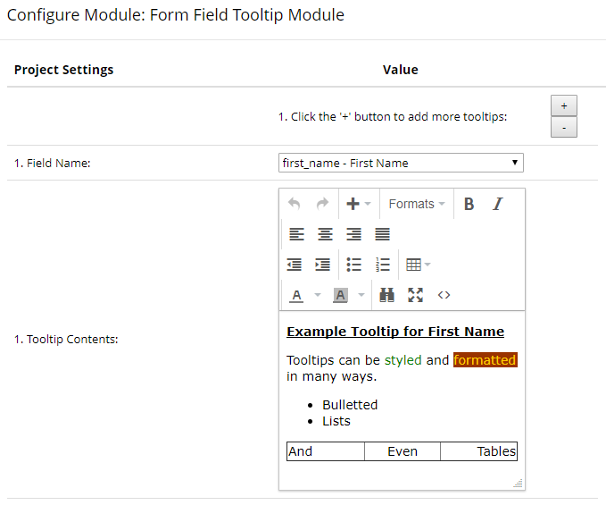
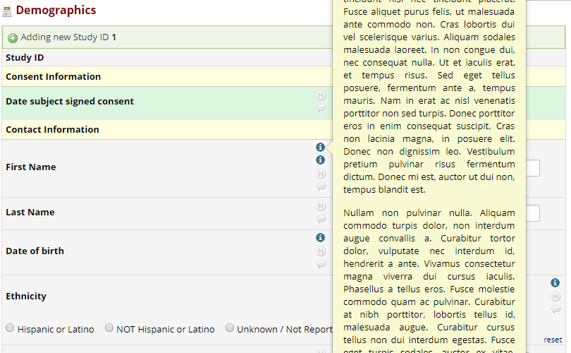

# Form Field Tooltip (REDCap External Module)
Adds tooltips to fields in data entry forms and surveys.

- For Data Entry Forms, tooltips are positioned in the same space, and just above, the History and Comment Log buttons.
- For Surveys, they are positioned just after the field label
   - This is due to a lack of any better placement location.  When viewing the survey form on the Data Entry side of things, tooltips display as they would a data entry form.

#### Data Entry Form Example

#### Survey Example

## Prerequisites
- REDCap >= 8.0.0

## Permissions
- redcap_data_entry_form
- redcap_survey_page

## Configuration
- Enable the module in your project if not already enabled
- Click **Configure** for **Form Field Tooltip Module**
- Select the field you wish to add a tooltip for
- Design the tooltip content in the rich text editor below
- To add additional tooltips, click on the '+' button

## Considerations
- Put as much detail in the tooltips as is necessary, but be wary of the length
  - Too much content and it may fall below the screen
- If you intend to use many tooltips on many forms, the configuration pop-up will get quite lengthy and hard to scan for a particular field you need to edit/remove.
  - Currently, there is no way around this situation, as this is the default behavior of the EM configuration pop-up.
- Not all field layout configurations have been tested
  - If you identify an issue with a particular configuration, please submit an issue on this GitHub repo or make a post on the forums and tag me (@chris.kadolph)

## Future Support
- Possible features that might come in future updates (depending on feedback)
  - An option to specify the where the tooltip opens, relative to the cursor (i.e. top center, bottom right, etc.)
  - Limit tooltips to 1 per field (currently there is no limit)

## Version Info
- 2.0
   - Added support for surveys
   - Switched tooltip implementation to the [Bootstrap Popover](http://getbootstrap.com/docs/3.3/javascript/#popovers)
- 1.0
   - Initial release